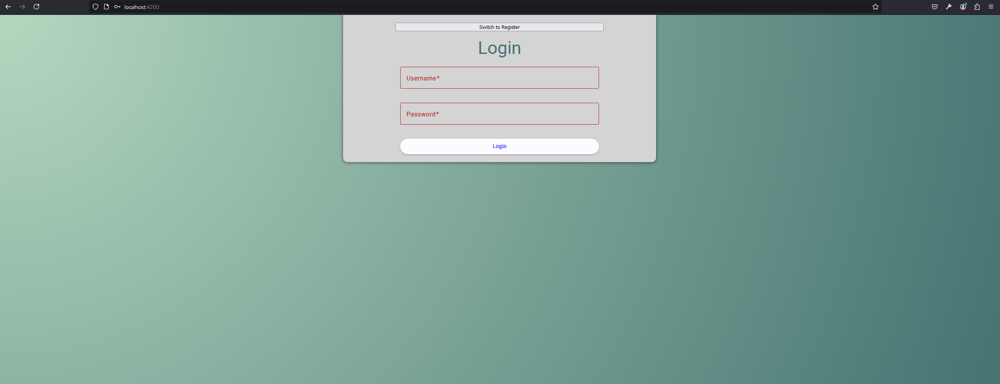
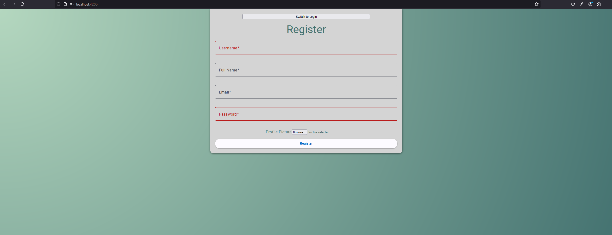

# Events-Project

## Project Description

Events-Project is a multi-layered application developed using .NET Core API, Angular, and Django REST Framework.
This project provides a platform where users can create and manage events, as well as participate in events.
The project runs using Docker containers, with Angular, .NET Core, Django, and PostgreSQL all operating in isolated environments.

## Features

- User registration and authentication (with ASP.NET Core Identity)
- Create, update, and delete events (Django REST API)
- Display and list event details (Angular frontend)
- Database management (PostgreSQL)

## Project Architecture

- **Backend (ASP.NET Core API and Django REST Framework):**
  - ASP.NET Core API is used for user management and authentication.
  - Django REST Framework provides the API for event management.
  - PostgreSQL is used as the database for both backends.

- **Frontend (Angular):**
  - Angular is used to build the user interface and interact with the Django API.
 
## Installation

### Steps

1. **Clone the Repository:**

   ```bash
   git clone https://github.com/Aaed517/EventsAPP.git
   cd EventsAPP-main

2. **Start Services with Docker:**

   ```bash
   docker-compose up --build

  This command will build and start the Docker containers for all services, including Angular, .NET Core API, Django REST Framework, and PostgreSQL.

## Usage

1. Access the Angular frontend at http://localhost:4200.
2. Interact with the APIs:
     - ASP.NET Core API: http://localhost:5024/index.html
     - Django REST Framework API: http://localhost:8000/api/events

## Example Screenshots

- Login Component: 
- Main Page: 
- Register Component: 
- Event Create Component: 

## License

This project is licensed under the MIT License - see the [LICENSE](LICENSE) file for details.
  


